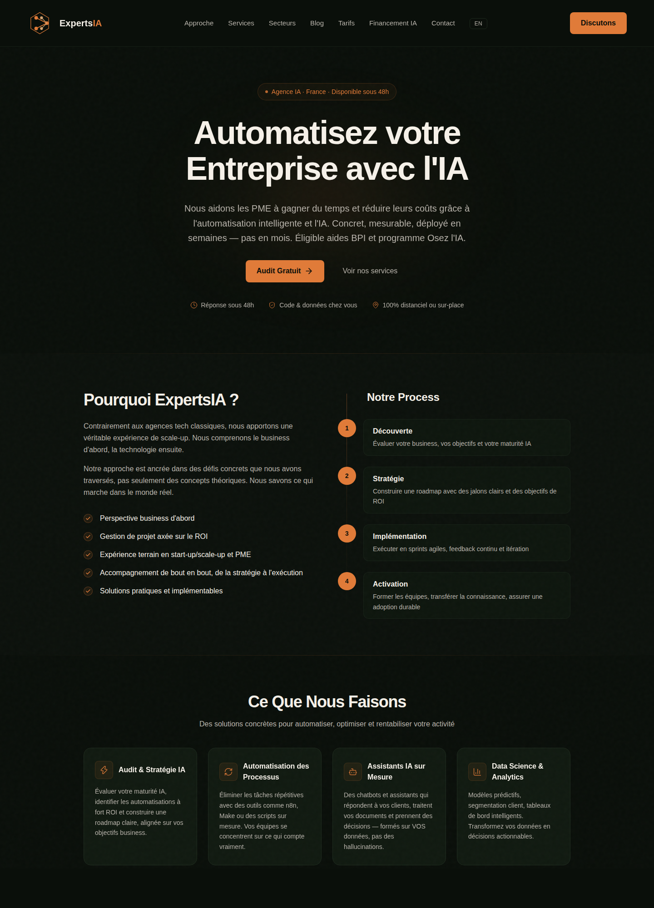

# ExpertsIA

Productized AI video production agency for French SMBs. Built and run by one person plus agents.

## The idea

French small businesses want video content (social clips, product demos, ads) but agencies charge €1-3k per video and freelancers are slow. AI generation tools exist but SMB owners don't want to learn ComfyUI.

ExpertsIA sells finished videos at a fixed price: the client sends a brief, the pipeline produces the video, a human checks it, delivered in 48h.

## How the production works

The interesting part is not one model, it's the pipeline. Every video goes through:

- Script and structure: LLM generation from the client brief, with a per-vertical template library
- Voiceover: neural TTS with French voice selection
- Visuals: local FLUX image generation on a 4070 Ti, video synthesis for animated segments
- Assembly: programmatic editing, captions burned in
- Human QA: every video checked before delivery. The AI does the 90%, the human pass is what makes it shippable

## Stack

| Layer | Tech |
|---|---|
| Site | Next.js 16 on Vercel |
| Edge | Cloudflare Workers, D1, KV |
| Production | ComfyUI, FLUX, TTS pipeline on local GPU |
| Ops | Automated cron pipelines, 10+ videos/day capacity |

## What I built

- The whole production pipeline, running daily on local hardware (zero marginal GPU cost)
- The agency site with lead capture on the Cloudflare edge stack
- The cron-driven batch system that produces content for multiple channels unattended

## Results

- Pipeline runs daily, 10 videos per day capacity, unattended
- Marginal cost per video close to zero (local generation, no per-video API spend)
- 48h brief-to-delivery, competing against agency timelines of 2-3 weeks

---

*This is a showcase repo: architecture and results only. The production pipeline source stays private.*
